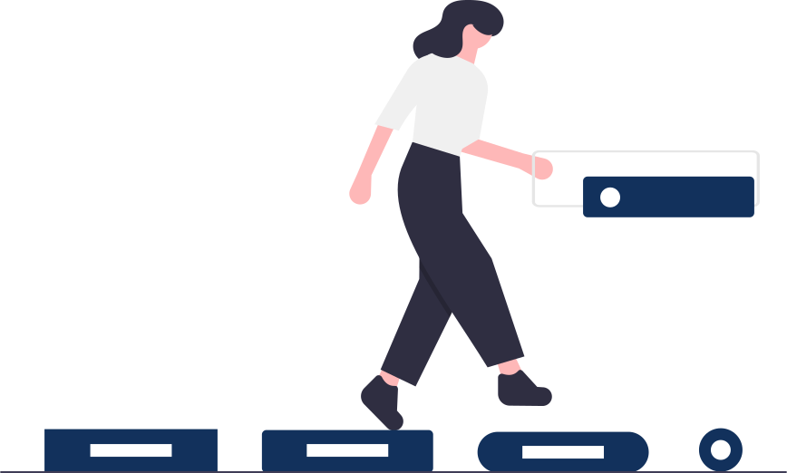

<p align="center">
  
</p>

## CSS


- `margin` espaçamento fora dos elementos, respiro externo. Para melhor entendimento, é usado na forma no sentido horário.

Exemplos:

```css
margin: top right bottom left;
margin: top/bottom right/left;
margin: top right/left bottom;
margin: top/right/bottom/left;
```

- `padding` espaçamento dentro dos elementos, respiro interno. Para melhor entendimento, é usado na forma no sentido horário.

Exemplos:

```css
padding: top right bottom left;
padding: top/bottom right/left;
padding: top right/left bottom;
padding: top/right/bottom/left;
```

## Centralizando elementos em relação ao pai

```css
.elemento-pai {
  position: relative;
}
.elemento-filho {
  position: absolute;
  left: 50%;
  top: 50%;
  transform: translate(-50%, -50%);
}
```
- Uma outra forma de centralizar elemento

```css
.elemento {
  display: block;
  margin: 0 auto;
}
```

- Só da para utilizar o `margin: 0 auto` quando o elemento tiver o `display: block` ou `display: table`, o elemento deve ter um `width` setado, quando o elemento não tiver `float` e o elemento não pode ter o `position: absolute` ou `position: static`

- `float` o elemento fica flutuando e caso tenha algum elemento abaixo, esse ultimo ocupa o espaço junto com o que foi utilizado o float, sendo que o que foi usado a propriedade float, vai para a frente. Float nunca esconde um conteúdo, o conteúdo define a largura(width) e altura(height) do elemento caso não seja definido. A propriedade float tem o comportamento de tirar do elemento pai, cria um novo contexto.

- `overflow: hidden` essa propriedade esconde o elemento, fazendo com que recalcule o contexto utilizado na propriedade `float`.

## Display: inline, block, inline-block

- `display: inline;` deixa elementos na mesma linha, nessa propriedade não conseguimos colocar width e height. Ele ganha o comportamento de uma palavra, um conteúdo.

- `display: block;` não deixa elementos na mesma linha, nessa propriedade conseguimos colocar width e height.

- `display: inline-block;` consegue deixar elementos na mesma linha e conseguimos definir width e height. Ele ganha o comportamento de uma palavra, um conteúdo.

## Position

- `position: absolute;` ele cria um novo contexto, ficando na frente de todos na tela, o que define width e height é o conteúdo dentro dele, com `top, left, right, bottom` é possivel mover em relação a pagina.

- `position: relative;` ele cria um novo contexto e tambem pode ser movido com `top, left, right, bottom` **ATUALIZAR DEPOIS**

- `box-sizing` padrão é `content-box`, colocando `border-box` o que voce informou no de width/height, é o que ele utiliza, já no `content-box`, ele absorve se você colocou alguma borda.

- `max-width` serve pra colocar o maximo de largura que o site vai ter para a tela

- `@media` sempre que ver algum `breakpoint`(quando o site quebra linhas e muda o layout do site) é usado essa propriedade.

- Para tirar o sublinhado do `<a></a>` é só colocar `text-decoration: none;`

- Unidades relativas, como `em` ou `rem`, são relativas a outro valor de comprimento. Por exemplo, em é baseado no tamanho da fonte de um elemento. Se você usá-lo para definir a propriedade de tamanho da fonte, ela será relativa ao tamanho da fonte do pai.

- Para criar variáveis no CSS precisa do `--`. Internet Explorer não aceita esse recurso.

Exemplo:
```css
--penguin-skin: gray;
``` 
E para utilizar essa variável é necessário utilizar o `var()`.

Exemplo:
```css
background-color: var(--penguin-skin);
```

- Variáveis CSS são herdadas assim como suas propriedades comuns, para fazer uso da herança, as variáveis CSS são frequentemente definidas no elemento: `:root`.

- `:root` é uma pseudo-classe que corresponde ao elemento raiz do documento.  Criando suas variáveis em: root, elas estarão disponíveis globalmente e podem ser acessadas de qualquer outro seletor.

- `stroke` dá para mudar a borda e a cor de uma imagem SVG

## Especificidade de seletores (CSS)

O de baixo sobreescreve o seletor de cima. Valores dos seletores para um melhor entendimento:
```
seletor id => 100

seletor class / pseudo seletores => 10

seletor tag => 1
```

